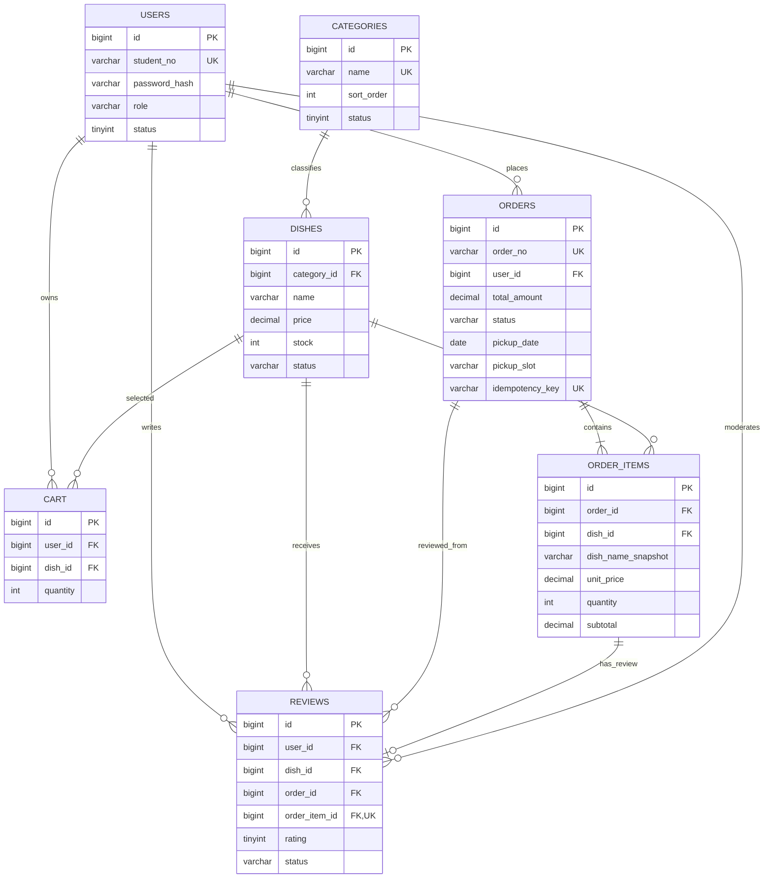

# ER 图

```mermaid
erDiagram
    USERS ||--o{ CART : owns
    DISHES ||--o{ CART : selected
    CATEGORIES ||--o{ DISHES : classifies
    USERS ||--o{ ORDERS : places
    ORDERS ||--|{ ORDER_ITEMS : contains
    DISHES ||--o{ ORDER_ITEMS : snapshots
    USERS ||--o{ REVIEWS : writes
    DISHES ||--o{ REVIEWS : receives
    ORDERS ||--o{ REVIEWS : reviewed_from
    ORDER_ITEMS ||--o| REVIEWS : has_review
    USERS ||--o{ REVIEWS : moderates
    USERS {
      bigint id PK
      varchar student_no UK
      varchar password_hash
      varchar role
      tinyint status
    }
    CATEGORIES {
      bigint id PK
      varchar name UK
      int sort_order
      tinyint status
    }
    DISHES {
      bigint id PK
      bigint category_id FK
      varchar name
      decimal price
      int stock
      varchar status
    }
    CART {
      bigint id PK
      bigint user_id FK
      bigint dish_id FK
      int quantity
    }
    ORDERS {
      bigint id PK
      varchar order_no UK
      bigint user_id FK
      decimal total_amount
      varchar status
      date pickup_date
      varchar pickup_slot
      varchar idempotency_key UK
    }
    ORDER_ITEMS {
      bigint id PK
      bigint order_id FK
      bigint dish_id FK
      varchar dish_name_snapshot
      decimal unit_price
      int quantity
      decimal subtotal
    }
    REVIEWS {
      bigint id PK
      bigint user_id FK
      bigint dish_id FK
      bigint order_id FK
      bigint order_item_id FK,UK
      tinyint rating
      varchar status
    }
```

字段和索引详见 [数据库设计](database-design.md)。
